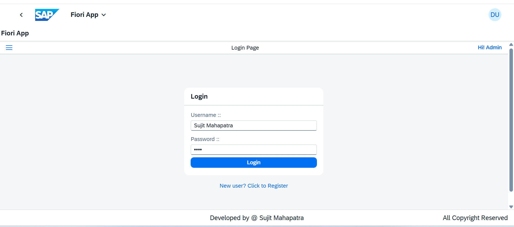
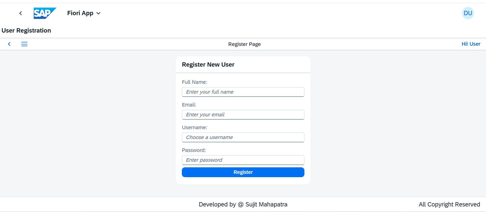
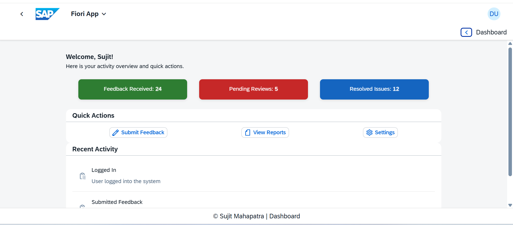

<h1 align="center"><b>📊 SAP UI5 Dashboard Application</b></h1>
<h3 align="center"><b><i>Login, Registration & Personalized Dashboard</i></b></h3>

---

  

---

## 📌 Overview  
This SAP UI5 application provides a seamless experience for users to **log in**, **register**, and access a personalized **dashboard**. The dashboard displays key metrics, quick actions, and recent activities.

✅ **Login & Registration** - Secure authentication and user onboarding  
✅ **Dashboard Cards** - Feedback Received, Pending Reviews, Resolved Issues  
✅ **Quick Actions** - Submit Feedback, View Reports, Settings  
✅ **Recent Activity** - List of latest user interactions  
✅ **Navigation & Footer** - Back button and author info

---

## 📸 Screenshots  

  
  
  
   
  <b>1️⃣ Login Page</b> &nbsp;&nbsp;&nbsp; <b>2️⃣ Registration Page</b> &nbsp;&nbsp;&nbsp; <b>3️⃣ Dashboard Overview</b>  
    

  
  
  
   
  <b>4️⃣ Dashboard Cards</b> &nbsp;&nbsp;&nbsp; <b>5️⃣ Quick Actions</b> &nbsp;&nbsp;&nbsp; <b>6️⃣ Recent Activity</b>  

---

## 🚀 Tech Stack Used  

| **Category**              | **Technologies**                           | **Purpose**                         |
|--------------------------|-------------------------------------------|-------------------------------------|
| **🖥️ Frontend**          | SAP UI5, XML Views                        | UI Development                      |
| **⚙️ Backend**           | JavaScript (Controller)                   | Logic & Event Handling              |
| **📦 Architecture**      | MVC                                       | Separation of Concerns              |
| **📁 Data Handling**     | JSON Models                               | Data Binding                        |

---

## ⚡ Features
✔ **Secure Login & Registration**  
✔ **Personalized Dashboard with Welcome Message**  
✔ **Activity Cards with Status Indicators**  
✔ **Quick Action Buttons with Icons**  
✔ **Recent Activity List from JSON Model**  
✔ **Responsive Layout with SAP UI5 Components**

---

## 🤝 Contributing  
Contributions are welcome! Feel free to **fork** the repo and submit a **pull request**.  

---

## 📩 Contact  

  
  &nbsp;&nbsp;&nbsp;
  
  &nbsp;&nbsp;&nbsp;
  

---

⭐ **If you like this project, don't forget to star the repo!** ⭐
